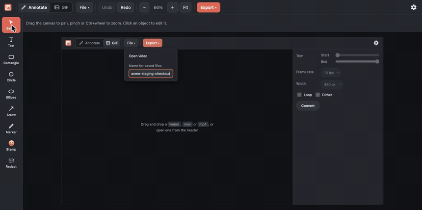
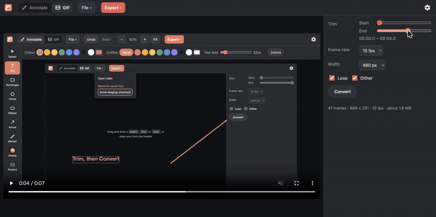

<h1 align="center">
  <br>
  <a href="https://akashi.jmatsu.dev"></a>
  <br>
  Akashi
  <br>
</h1>

<h4 align="center">Screenshots and screen recordings, made ready for a ticket — in the browser, on your device alone.</h4>

<p align="center">
  <a href="https://akashi.jmatsu.dev"></a>
  
  <a href="LICENSE"></a>
</p>

<p align="center">
  <a href="#annotate">Annotate</a> •
  <a href="#gif-a-screen-recording-into-something-you-can-paste">GIF</a> •
  <a href="#principles">Principles</a> •
  <a href="#nothing-leaves-the-device">Privacy</a> •
  <a href="#keyboard-shortcuts">Shortcuts</a> •
  <a href="#development">Development</a> •
  <a href="CONTRIBUTING.md">Contributing</a>
</p>

<p align="center">
  
  <br>
  <em><b>Annotate</b> — drop a screenshot in, point at the thing, mosaic what must not travel.</em>
</p>

<p align="center">
  
  <br>
  <em><b>GIF</b> — trim the clip with two handles, convert, and paste the result.</em>
</p>

<p align="center">
  Lightweight tools for the things developers, QA and PO do to screenshots and
  screen recordings before pasting them into a ticket. No account, no upload, no
  backend — what you open never leaves the tab you opened it in.
</p>

---

Currently, Akashi offers two apps, switched from the header beside the mark.
The rest of the header is **File** and **Export**, and the gear at the far end
holds the product menu:

| App | URL | What it does |
| --- | --- | --- |
| **Annotate** | `/` | Text, shapes, arrows, markers, stamps and redaction on a screenshot |
| **GIF** | `/?app=gif` | A `webm`, `mov` or `mp4` clip trimmed and converted to an animated GIF |

<details><summary>The name of Akashi?</summary>

**証** (*akashi*) is a Japanese word for evidence — the proof you attach to a ticket so
that a bug is something someone else can see. It is also what the app does, in
order: **A**nnotate, **K**nit, **A**ssure, **SH**ip. Mark up the screenshot,
stitch the recording into a single artefact, redact what must not travel, and
hand it on.

</details>

## Principles

- Works with offline.
- Run on Windows, macOS, Linux, Android and iOS.
- Nothing you open leaves your device. Safe for everyone.
  - Backend-less, no upload, no network request
- Minimum external dependencies

These are design principles, not a warranty. See [DISCLAIMER](DISCLAIMER.md).

## Annotate

| Tool | What it does |
| --- | --- |
| Text | Any size and colour. Typed on the canvas through a real `<textarea>`, so IME input works |
| Shapes | Rectangle, circle, ellipse. Stroke width and colour, optional fill |
| Arrows | Line, single-headed or double-headed. Colour and width |
| Marker | Translucent highlighter. Width and colour |
| Stamps | 32 common emoji, resizable |
| Outline | A contrasting halo behind any of the above, in the colour of your choice, for annotations that would otherwise disappear into the screenshot |
| Redaction | Mosaic (block size), blackout, or erase to transparent (strength) |

Everything is **non-destructive**. A mosaic is an object like any other: move
it, resize it, delete it, undo it. The original pixels are kept until you
export.

## Draft annotations: continuing on another device

Akashi allows you annotate on your phone, finish on your desktop. Tap **Export ▸ Draft** (`Ctrl/Cmd+Shift+S`), then Akashi writes a `.akashi` file that the other device's Akashi reopens with every object still selectable. **AirDrop, Quick Share, a cable or a shared folder all carry it as-is, with no server involved.**

Please note that a draft file (`.akashi`) is a real PNG file but do not treat this as a shareable image format. The original image and annotations are stored independently in the `.akashi` file, allowing the recipient to recover the original image file.

## Nothing leaves the device

The screenshots people annotate here are the ones they cannot send anywhere:
staging data, a customer's account, an unreleased screen. So Akashi has no server,
no analytics and no telemetry — and rather than leave that as a promise, three
barriers hold the code to it:

- **The browser enforces it.**
  - `src/csp.ts` states a Content-Security-Policy.
- **The linter refuses to write it.**
  - `biome.json` denies `fetch`, `XMLHttpRequest`, `WebSocket`, `EventSource` and `RTCPeerConnection` outright.
- **The build is checked.**
  - `test/offline.test.ts` covers generated and vendored code, which the first two barriers do not.

> **Draft** is an exception but we expect you will be transferring the data between the two devices on your own initiative.

## GIF: a screen recording into something you can paste

Drop a `webm`, `mov` or `mp4` in, trim it with the two handles, convert, and
take the result from **Export ▸ Save GIF**. Frame rate, output width, looping
and dithering are the settings.

- **Nothing is bundled to decode video**
  — The clip is never uploaded to be read: it reaches the `<video>` element as a blob of its own bytes.
- **The GIF handling also requires no backend**
  - Rust WASM does. See [the gif modules in `crate/src`](crate/src).

## Keyboard shortcuts

In the annotation app:

| Keys | Action |
| --- | --- |
| `V` `T` `R` `O` `E` `A` `M` `S` `G` | Select / Text / Rectangle / Circle / Ellipse / Arrow / Marker / Stamp / Redact |
| `Ctrl/Cmd+Z` / `Ctrl/Cmd+Shift+Z` | Undo / redo |
| `Delete` `Backspace` | Delete the selection |
| `Esc` | Deselect, or confirm the text you are typing |
| `Ctrl/Cmd+S` / `Ctrl/Cmd+Shift+S` | Save a PNG / write a `.akashi` draft |
| `Ctrl/Cmd+0` / `Ctrl/Cmd+1` | Fit to window / actual size |
| `Shift` + drag | Constrain to a square or circle; snap arrows to 45° |

Drag empty canvas (or middle-drag anywhere) to pan; `Ctrl` + wheel or pinch to
zoom. Whatever you just drew stays selected: drag a handle to resize it, drag
the dashed outline to move it, both of which keep working while a drawing tool
is active. Grabbing an object by its body is the select tool's job (`V`), so
that you can draw on top of existing shapes.

# Development

For agents, respect [Principles](#principles) first.

## Setup

You need Node and a Rust toolchain with the wasm target.

```sh
curl --proto '=https' --tlsv1.2 -sSf https://sh.rustup.rs | sh -s -- -y \
  --profile minimal -t wasm32-unknown-unknown
curl -sSfL https://rustwasm.github.io/wasm-pack/installer/init.sh | sh
export PATH="$HOME/.cargo/bin:$PATH"

npm install
```

## Tools

```sh
npm run dev           # build wasm, then start the Vite dev server
npm run build         # production build into dist/
npm run preview       # serve the build (use this to check PWA behaviour)
npm test              # Rust unit tests + the web tests (after a build: one reads dist/)
npm run lint          # Biome (TS/CSS) + clippy (crate)
npm run format        # Biome + rustfmt, writing changes
npm run format:check  # the same check CI runs
```

`dist/` is static files, so any host will do; for a sub-path deploy, build with
`AKASHI_BASE=/akashi/ npm run build`. CI runs the same checks on every push and
pull request. `main` is published to Cloudflare Pages, and a pull request from
this repository gets a preview deployment commented onto it.

To add a language, drop a catalog into `src/locales/` and list it in `index.ts`.
`en.ts` is the reference — every other catalog is typed as `Catalog`, so a
missing or extra key is a compile error.

## Experiments

The GIF encoder also runs from a shell, and a prototype takes a screenshot off
an Android phone over Wi-Fi by speaking ADB itself — both behind Cargo features
the app never builds. That and anything else tried outside the browser is in
[EXPERIMENT](EXPERIMENT.md).

## Architecture

Vite, TypeScript and vite-plugin-pwa are the only dependencies: no UI framework,
no canvas library, no i18n library, no video or GIF library. Opening the
annotation app costs about 36KB gzipped, 16KB of that wasm; the converter is
another 7KB, fetched only when you switch to it. 145KB is precached.

Shared code sits at the root of `src/`; everything else belongs to one app.
Adding a third app is a `src/apps/<id>/index.ts` exporting `mount()`, an entry
in `APPS`, and a `data-app` block in `index.html`.

```
crate/src/lib.rs        Rust: what the wasm core exports
crate/src/region.rs     Pixel effects (mosaic / blackout / transparent)
crate/src/gif.rs        Animated GIF: palette, frame differencing, container
crate/src/gif/palette.rs  Median cut, the colour lookup table, dithering
crate/src/gif/lzw.rs    The LZW variant GIF compresses with
crate/src/bin/akashi-gif.rs  The encoder as a CLI, behind the `cli` feature
crate/src/adb.rs        ADB over TCP/IP: the handshake and one stream at a time
crate/src/adb/message.rs  The 24-byte packet header every ADB message carries
crate/src/adb/auth.rs   Signing the daemon's challenge with ~/.android/adbkey
crate/src/adb/sync.rs   The `sync:` service, and the `RECV` behind `adb pull`
crate/src/bin/akashi-adb.rs  Screenshots off a phone, behind the `adb` feature

src/main.ts             Boot: language, wasm, router, service worker
src/apps.ts             The registry, and how a URL names an app (DOM-free)
src/router.ts           Shows one app at a time, and the switcher
src/dom.ts              must() / toast() / download()
src/wasm.ts             Bringing the core up, once, for both apps
src/filename.ts         Turning a document name into a file name safely
src/png.ts              PNG container: signature, chunks, CRC
src/brand.ts            Colours and icon specs, shared with the build
src/csp.ts              The no-network policy, shared with the build and tests
src/i18n.ts             Locale detection, persistence and application
src/locales/            The catalogs (DOM-free; the build and tests read them)

src/apps/editor/index.ts   Header, file in/out, shortcuts
src/apps/editor/types.ts   Document model, and what is stylable per type
src/apps/editor/geom.ts    Hit testing, bounds, handles, resize (DOM-free)
src/apps/editor/render.ts  Drawing the document onto the 1:1 scene canvas
src/apps/editor/editor.ts  State, history, pointer handling, viewport
src/apps/editor/ui.ts      Toolbar and the contextual options bar
src/apps/editor/draft.ts   Reading and writing drafts
src/apps/editor/region.ts  The wasm bindings for redaction

src/apps/gif/index.ts   The converter: controls, conversion loop, result
src/apps/gif/plan.ts    Which frames, how big, how long (DOM-free)
src/apps/gif/video.ts   Seeking a <video> and reading frames off a canvas
src/apps/gif/encoder.ts The wasm bindings for the GIF encoder

scripts/make-icons.mjs  Generates the PWA icons from geometry
```

Two things are in wasm, both for the same reason — a pixel loop run far too
often for JS. Redactions reprocess the pixels under them on every frame of a
drag; a conversion quantises, diffs and compresses every frame of a clip.

Rendering stays on Canvas 2D, which is what lets a real `<textarea>` sit over
the canvas for IME input. The scene canvas is kept separate from the visible one
because `getImageData` ignores transforms, so redactions need a canvas at
document scale to be correct at any zoom; selection handles are drawn only on
the visible one and so never reach an export.

## Contributing

Issues are welcome; open one and let it be discussed before writing a pull
request. See [CONTRIBUTING](CONTRIBUTING.md). A vulnerability goes through a
[security advisory](https://github.com/jmatsu/akashi/security/advisories/new)
rather than a public issue: see [SECURITY](SECURITY.md).

## License

Apache License 2.0. See [LICENSE](LICENSE) and [NOTICE](NOTICE).
The software is provided "AS IS"; see [DISCLAIMER](DISCLAIMER.md).
